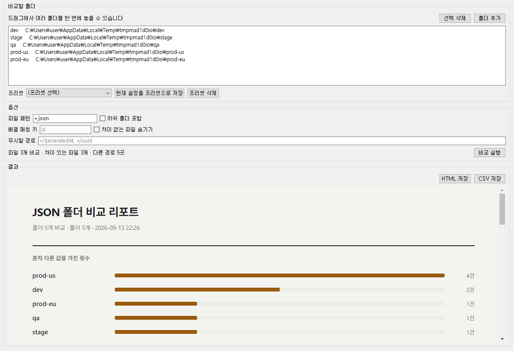

# JSON Folder Diff

여러 폴더에 흩어진 같은 이름의 JSON 파일들을 **N개 동시에** 비교해서 차이를 보여주는
Windows 데스크톱 도구. PyQt5 GUI이고, 결과는 오프라인 단일 HTML 리포트로 나온다.

환경별 설정 폴더(dev / stage / qa / prod-us / prod-eu)를 한 번에 열어 "어느 환경만 값이
다른가"를 찾는 용도다. 폴더 개수는 고정이 아니라 2개 이상 원하는 만큼 추가할 수 있다.



## 하는 일

- 폴더 **N개**를 한 번에 비교한다. 폴더끼리 1:1로 짝지어 비교하는 게 아니라, JSON 경로마다
  N개 값을 모아 같은 값끼리 묶는다.
- 과반이 같은 값을 가질 때 소수 쪽을 **혼자 튄 것(outlier)** 으로 표시하고, 폴더별로 몇 번
  튀었는지 리포트 맨 위에 정리한다.
- 어떤 폴더에만 있는 파일, 어떤 폴더에 **없는** 파일을 따로 알려주고, 그 파일을 실제로 가진
  폴더끼리만 내용을 비교한다.
- `30` 과 `"30"` 처럼 타입만 다른 경우, 키 자체가 없는 경우, `null`과 키 없음을 구분한다.
- 배열은 기본적으로 순서(인덱스) 기준이지만, 매칭 키(예: `id`)를 주면 순서가 달라도
  같은 항목끼리 비교한다.
- 결과는 오프라인 단일 HTML(검색 기능 내장)과 CSV로 저장할 수 있다.

## 사용법

1. **폴더 추가** — 버튼으로 하나씩 고르거나, 탐색기에서 여러 폴더를 창에 끌어다 놓는다.
   목록의 순서가 리포트의 열 순서이고, 드래그로 바꿀 수 있다.
2. **옵션** — 파일 패턴(`*.json`), 하위 폴더 포함, 배열 매칭 키, 무시할 경로
   (`*/generatedAt, */uuid` 처럼 쉼표로 구분), 차이 없는 파일 숨기기.
3. **비교 실행** — 결과가 창 안에 바로 뜬다. 리포트 안에서 파일명·경로·값으로 검색할 수 있다.
4. **저장** — HTML(그대로 공유 가능) 또는 CSV(엑셀용, 한글 안 깨짐).
5. **프리셋** — 자주 쓰는 폴더 조합과 옵션을 이름 붙여 저장한다. 창을 닫을 때 마지막 상태가
   자동 저장되어 다음 실행 때 복원된다(`%APPDATA%\JsonFolderDiff\presets.json`).
   프리셋에 적힌 폴더가 사라졌으면 회색으로 표시되고 비교에서 빠진다.

## 받는 사람이 파이썬 없이 쓰려면

`dist\JsonFolderDiff.exe` 하나만 건네면 된다. 설치 과정이 없고, 더블클릭하면 바로 뜬다.
Windows 10/11 64비트/32비트 모두 동작하며 별도 런타임(WebView2 등)이 필요 없다
(Chromium이 exe 안에 들어있다). 크기는 약 90MB.

> exe는 저장소에 커밋되지 않는다(`.gitignore`). 배포할 때는 GitHub **Releases**에 올려서
> 링크를 전달한다.

## 다른 컴퓨터에서 시작하기

Windows + **Python 3.11 이상**이 필요하다.

```powershell
git clone <저장소 주소>
cd json-diff-gui
python -m venv .venv
.\.venv\Scripts\Activate.ps1
pip install -r requirements.txt
```

잘 받아졌는지 확인:

```powershell
pytest -q                                        # 29개 통과해야 한다
python -m jsondiff.cli --root .\sample\envs -o report.html
```

## 실행

```powershell
python -m jsondiff.app                                       # GUI
python -m jsondiff.cli --root .\sample\envs -o report.html   # CLI
pytest -q                                                    # 테스트
ruff check src tests scripts                                 # 린트
python scripts\build_exe.py                                  # exe 빌드
```

`.venv`를 안 쓰고 소스를 바로 돌릴 때는 `src`가 import 경로에 있어야 한다
(`$env:PYTHONPATH="src"`). `pytest`는 `pyproject.toml` 설정으로 알아서 잡는다.

## 배포용 exe

```powershell
python scripts\build_exe.py      # dist\JsonFolderDiff.exe
```

테스트·린트를 먼저 통과해야 빌드된다. 산출물은 `dist/`에 생기고 **저장소에는 커밋되지 않는다**
(`.gitignore`). 파이썬이 없는 사람에게 건네려면 GitHub Releases에 exe를 올려서 전달한다.
자세한 주의사항은 `.claude/skills/build-exe/SKILL.md`.

## Claude Code로 이어서 작업하기

```powershell
cd json-diff-gui
claude
```

`CLAUDE.md`와 `.claude/`가 저장소에 함께 들어있어서, 클론만 하면 규칙·스킬이 그대로 적용된다.
세션을 이렇게 시작하면 된다.

```
docs/ROADMAP.md 를 읽고 다음 단계부터 이어서 해줘.
```

현재 1~3단계 완료. 남은 것은 4단계(프리셋), 5단계(아이콘·배포 검증), 6단계(대용량·고DPI·실환경).

## 문서

| 파일 | 언제 읽히나 |
|---|---|
| `CLAUDE.md` | 매 세션 자동 |
| `.claude/rules/python.md` | Python 파일을 다룰 때 |
| `.claude/skills/build-exe/SKILL.md` | exe 빌드를 요청할 때 |
| `docs/SPEC-engine.md` | 비교 로직을 건드릴 때 (직접 지시) |
| `docs/SPEC-ui.md` | 화면을 만들 때 (직접 지시) |
| `docs/ROADMAP.md` | 세션 시작마다 (직접 지시) |
| `reference/json_folder_diff.py` | 이식 원본이 된 프로토타입 (참고용, 실행 경로 아님) |
